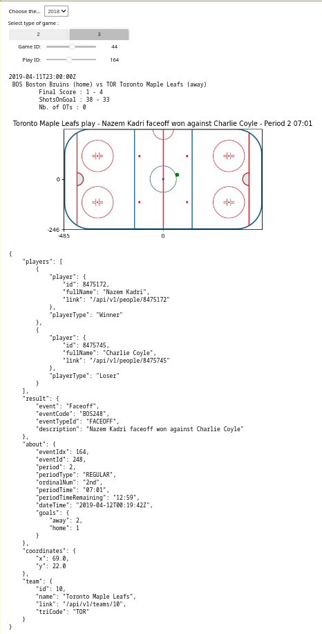

# Interactive Data Debugging Tool presentation



> L'outil permet de selectionner (l'ordre de selection est important car le choix d'une valeur d'un widget en impacte un autre):
>
> 1. La Saison de NHL
> 2. Le type de matchs - 2 -> Regular, 3 -> Playoff (dans notre cas nous avons juste des donnees pour des regular et playoff games, mais facilement extensible ...)
> 3. Le Game ID
> 4. Le Play ID
>
> afin d'afficher les coordonnees de ce play et son dictionnaire associe et aussi, des infos a propos du game selectionne.

# Code de l'outil

## main section

```python
def get_max_game_id(season, game_type):
    return len(extract_gamestat_regular_or_playoff(season, game_type)) - 1

def get_max_play_id(season, game_type, game_id):
    data = extract_game_stat_per_games(
        data_generator=extract_gamestat_regular_or_playoff(season, game_type),
        game_id=game_id
    )
    return len(data.liveData.plays.allPlays) - 1

# Default values based on current widget settings
default_max_game_id = get_max_game_id(YEARS[0], 2)
default_max_play_id = get_max_play_id(YEARS[0], 2, 0)

season_selected_widget = widgets.Dropdown(
    options=YEARS,
    value=YEARS[0] if YEARS else None,  # Set to latest season. If YEARS is empty, set to None.
    description="Choose the NHL Season year (2016 -> 2016-2017) : ",
    layout={"width": "max-content"},
)

type_game_selected_widget = widgets.ToggleButtons(
    options=[2, 3],
    value=2,  # Set to Regular season
    description="Select type of game : ",
    tooltips=["Regular season", "Playoffs"],
    layout={"width": "max-content"},
)

game_id_widget = widgets.IntSlider(
    value=0,  # First game
    min=0,
    max=default_max_game_id,  # Correct max value based on season and game type
    step=1,
    description="Game ID:",
    continuous_update=False,
    orientation="horizontal",
    readout_format="d",
)

play_id_widget = widgets.IntSlider(
    value=0,  # First play
    min=0,
    max=default_max_play_id,  # Correct max value based on season, game type, and game id
    step=1,
    description="Play ID:",
    continuous_update=False,
    orientation="horizontal",
    readout_format="d",
)

SVG_FILE_PATH = "./hocker_court.jpg"

def update_game_id_widget_max(*args):
    game_id_widget.value = 0
    play_id_widget.value = 0
    game_id_widget.max = len(
        extract_gamestat_regular_or_playoff(
            season_selected_widget.value, type_game_selected_widget.value
        )
    ) - 1

def update_on_season_change(*args):
    game_id_widget.value = 0
    play_id_widget.value = 0
    update_game_id_widget_max()
    update_play_id_widget_max()


def update_play_id_widget_max(*args):
    play_id_widget.value = 0
    play_id_widget.max = len(
        extract_game_stat_per_games(
                data_generator=extract_gamestat_regular_or_playoff(
                    season_year=season_selected_widget.value,
                    type_of_game=type_game_selected_widget.value,
                ),
                game_id=game_id_widget.value,
            ).liveData.plays.allPlays
        ) - 1

# Observers
season_selected_widget.observe(update_on_season_change, "value")
type_game_selected_widget.observe(update_game_id_widget_max, "value")
type_game_selected_widget.observe(update_play_id_widget_max, "value")
game_id_widget.observe(update_play_id_widget_max, "value")

```

```python
import ipywidgets
from dotenv import load_dotenv

import json
import os
from pathlib import Path
from omegaconf import OmegaConf
from pregex.core.quantifiers import Optional
from pregex.core.groups import Capture
from pregex.core.operators import Either
from pregex.meta.essentials import Integer
from pregex.core.classes import AnyLetter, AnyDigit
from pregex.core.assertions import MatchAtEnd, MatchAtStart, EnclosedBy
from pregex.core import Pregex

from typing import Literal

from ipywidgets import interact, interactive, fixed, interact_manual
import ipywidgets as widgets

from rich import print as rprint
from pprint import pprint as pp

load_dotenv()

interact(
    display_game_stat,
    season_year=season_selected_widget,
    type_of_game=type_game_selected_widget,
    game_id=game_id_widget,
    index_play=play_id_widget,
    SVG_FILE_PATH=fixed(SVG_FILE_PATH),
)
```


## Functions

### global function

```python-repl
def display_game_stat(
        season_year : str,
        type_of_game : Literal[2,3],
        game_id : int,
        index_play : int,
        SVG_FILE_PATH : str
    ):

    path_files_generator = extract_gamestat_regular_or_playoff(season_year, type_of_game)
    data_plays = extract_game_stat_per_games(path_files_generator, game_id, verbose=True)
    display_on_hockey_court_play( data_plays, index_play, SVG_FILE_PATH)
```


---

### Plot play id

```python
def plot_play_on_svg(
        play_to_plot,
        svg_file_path,
    ):

    import matplotlib.pyplot as plt
    import matplotlib.image as mpimg
    import numpy as np

    img = mpimg.imread(svg_file_path)

    # Create a figure and axis
    fig, ax = plt.subplots()
    ax.imshow(img,origin='lower')

    # Set the tick positions and labels
    ax.set_xticks([0, img.shape[1] // 2, img.shape[1]])
    ax.set_yticks([0, img.shape[0] // 2, img.shape[0]])
    ax.set_xticklabels([-img.shape[1] // 2, 0, img.shape[1] // 2])
    ax.set_yticklabels([-img.shape[0] // 2, 0, img.shape[0] // 2])

    coords = np.array(list(map(int, play_to_plot.coordinates.values()))) + np.array([img.shape[1] // 2, img.shape[0] // 2])
    ax.plot(*coords, 'go')

    plt.title(f'{play_to_plot.team.name} play - {play_to_plot.result.description} - Period {play_to_plot.about.period} {play_to_plot.about.periodTime}')
    plt.show()

def display_on_hockey_court_play(data_plays, index_play, svg_file_path : Path):

    list_of_plays = data_plays.liveData.plays.allPlays
  

    play_of_interest = list_of_plays[index_play]
    if not play_of_interest.coordinates == {}:
        plot_play_on_svg(list_of_plays[index_play], svg_file_path)
    else:
        print('No coordinates available for this play')
  
    print(json.dumps(OmegaConf.to_object(play_of_interest), indent=4))
```

### Choose game id

```python
def extract_game_stat_per_games(
        data_generator : list[Path],
        game_id : int,
		verbose : bool = False,
    ):

	with open(data_generator[game_id] ,'r') as json_file_buffer:
		file_content = json.load(json_file_buffer)
	data = OmegaConf.create(file_content)

	if verbose:
		print(data.gameData.datetime.dateTime)
		print(f' {data.gameData.teams.home.abbreviation} {data.gameData.teams.home.name} (home) vs {data.gameData.teams.away.abbreviation} {data.gameData.teams.away.name} (away)')  
		print(f' \t Final Score : {data.liveData.boxscore.teams.home.teamStats.teamSkaterStats.goals} - {data.liveData.boxscore.teams.away.teamStats.teamSkaterStats.goals}')  
		print(f' \t ShotsOnGoal : {data.liveData.boxscore.teams.home.teamStats.teamSkaterStats.shots} - {data.liveData.boxscore.teams.away.teamStats.teamSkaterStats.shots}')
		print(f' \t Nb. of OTs : {len(data.liveData.linescore.periods) - 3}')
	return data
```

### Choose Season year and type of game

```python
def extract_game_ids_regular_or_playoff(type_of_game : Literal[2,3], path_json_files : Path):
    regex_filename = MatchAtStart(4*AnyDigit()) + str(type_of_game).zfill(2) + MatchAtEnd(4*AnyDigit())
    return list(filter(lambda p : regex_filename.get_matches(p.stem), path_json_files.glob('*')))

def extract_gamestat_regular_or_playoff(
    season_year : str,
    type_of_game : Literal[2,3]
    ) -> List[Path]:

    if os.getenv('DATA_FOLDER'):
        root_data_path = os.getenv('DATA_FOLDER')
    else:
        raise RuntimeError(f'''
                            PLEASE RUN dotenv.load_dotenv() WITH SPECIFYING A VENV VAR: DATA_FOLDER
                            ''')
  
    # The next 2 digits give the type of game, where 01 = preseason, 02 = regular season, 03 = playoffs, 04 = all-star
    json_file_path = Path(root_data_path) / season_year 
    games_ids = extract_game_ids_regular_or_playoff(type_of_game, json_file_path)
    return games_ids
```
