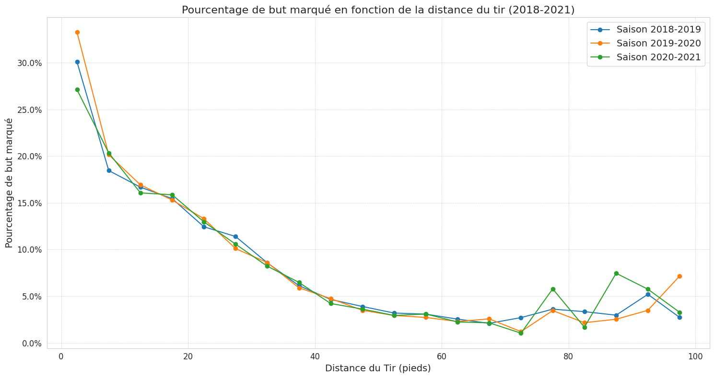
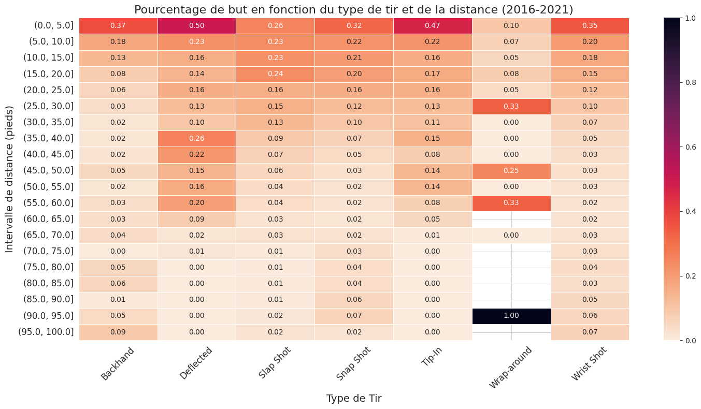

# Analyse des types de tirs en 2020 : Quels sont les plus efficaces ?

Lorsque vous regardez un match de hockey, il peut sembler que chaque tir est une décision prise dans le feu de l'action, dictée par l'instinct plutôt que par la stratégie. Cependant, une analyse approfondie des statistiques de tirs de la saison 2020 nous donne un aperçu fascinant des décisions tactiques prises par les joueurs sur la glace.

D'abord, un point sur notre graphique : nous avons utilisé une échelle logarithmique pour mieux visualiser la grande différence d'échelle entre les types de tirs. Cela a rendu particulièrement évidente la prédominance du "Wrist Shot", avec 32971 tirs répertoriés, par rapport à des types de tirs moins courants comme le "Wrap Around", qui compte seulement 509 observations.

Mais au-delà de la fréquence, qu'en est-il de l'efficacité? Le pourcentage de buts par rapport aux tirs est une mesure précieuse ici. Les "Snap Shots" (10,41%), "Backhands" (12,08%), "Tip-Ins" (18,02%) et "Deflected" (15,58%) se démarquent comme étant parmi les plus dangereux. Chacun de ces tirs a une chose en commun : ils sont imprévisibles et rapides, rendant la tâche ardue pour le gardien de but. Bien que puissants, ils sont aussi capricieux et ne sont pas toujours la meilleure option en match. C'est précisément cette imprévisibilité qui les rend redoutables, même si leur mise en œuvre peut s'avérer complexe.

En ce qui concerne la popularité, le "Wrist Shot" règne en maître. Avec plus de 32 971 tirs répertoriés, il dépasse largement le "Slap Shot" qui arrive en deuxième place avec 7800 tirs. Le "Wrist Shot" est le choix de prédilection car il équilibre puissance et précision, tout en étant versatile pour différentes situations de jeu. Son taux de succès de 9,09% est impressionnant, surtout compte tenu de sa fréquence d'utilisation.

En fin de compte, le choix du tir est un équilibre délicat entre l'opportunité, la stratégie et l'habileté. Et, comme le montrent ces statistiques, quand il est bien exécuté, cela peut être la différence entre une victoire et une défaite.

# Comment la distance d'un tir affecte-t-elle la probabilité de marquer un but ? 

Le graphique ci-dessus présente clairement cette relation. Pour établir celle-ci, nous avons calculé les distances euclidiennes entre le lieu du tir et le but. Ces distances ont ensuite été classées par tranches de 5 pieds. Cette méthode nous a permis de déterminer la proportion de buts en fonction du nombre total de tirs pour chaque tranche de distance.

L'observation initiale est assez simple : plus un joueur est proche du but, plus il a de chances de marquer. Les tirs effectués à moins de 20 pieds du but ont une probabilité élevée de se transformer en but. Cependant, à mesure que cette distance s'allonge, la probabilité diminue, ce qui est logique. Tenter de marquer depuis une zone intermédiaire, disons entre 20 et 60 pieds, est plus ardu que depuis une zone rapprochée.

Là où les choses deviennent particulièrement intéressantes, c'est lorsque nous observons les tirs effectués à partir de 60 pieds et plus. Ici, la variance est beaucoup plus prononcée. Pourquoi ? La raison est simple : le nombre d'échantillons (c'est-à-dire de tirs) à cette distance est faible. Ainsi, chaque but réussi ou manqué a un impact considérable sur la moyenne générale, créant des fluctuations notables dans notre graphique.

En analysant les différentes courbes représentant les saisons, nous constatons que la tendance générale est identique. Les variations mineures, en particulier aux extrémités de la courbe, peuvent s'expliquer par la faible densité de points à ces distances. C'est un phénomène courant en statistique : lorsque le nombre d'échantillons est réduit, une petite variation peut avoir un impact disproportionné sur l'ensemble des résultats.

Pour conclure, ce graphique linéaire a été choisi pour sa capacité à présenter clairement des tendances sur une période donnée. Il offre non seulement une vision limpide de l'évolution de la probabilité de marquer en fonction de la distance du tir, mais permet également de comparer efficacement les données sur plusieurs saisons.

# Et si on réunissait les deux?

Dans l'analyse de l'impact de la distance et du type de tir sur le taux de réussite dans le hockey, plusieurs tendances significatives émergent. En général, il est clair que les tirs les plus dangereux sont à la fois imprévisibles et proches du filet.

Les tirs tels que les "Deflected," "Tip-in," et "Backhand" se démarquent comme étant parmi les plus redoutables, surtout à courte distance. Leur caractère imprévisible met les gardiens de but dans une position difficile, ce qui les rend extrêmement efficaces à proximité du filet.

Cependant, il convient de noter que le "Wrist Shot" reste une option fiable pour des distances inférieures à 25 pieds. Sa précision et sa puissance lui confèrent une place de choix dans les stratégies de tir des joueurs.

Le cas particulier du "Deflected Shot" intrigue avec sa capacité à maintenir un taux de réussite étonnamment élevé pour des tirs entre 35 et 55 pieds du but. Cette exception suggère que la redirection des tirs est une stratégie hautement efficace, même lorsque la distance s'allonge. Il est important de souligner que cette technique est souvent maîtrisée par les joueurs de haut niveau, qui sont capables de rediriger des tirs puissants, maintenant ainsi une bonne performance à longue distance.

En fin de compte, les données révèlent que les tirs les plus dangereux sont ceux qui parviennent à surprendre les gardiens de but par leur imprévisibilité et leur rapidité, tout en étant effectués à proximité du filet. 

